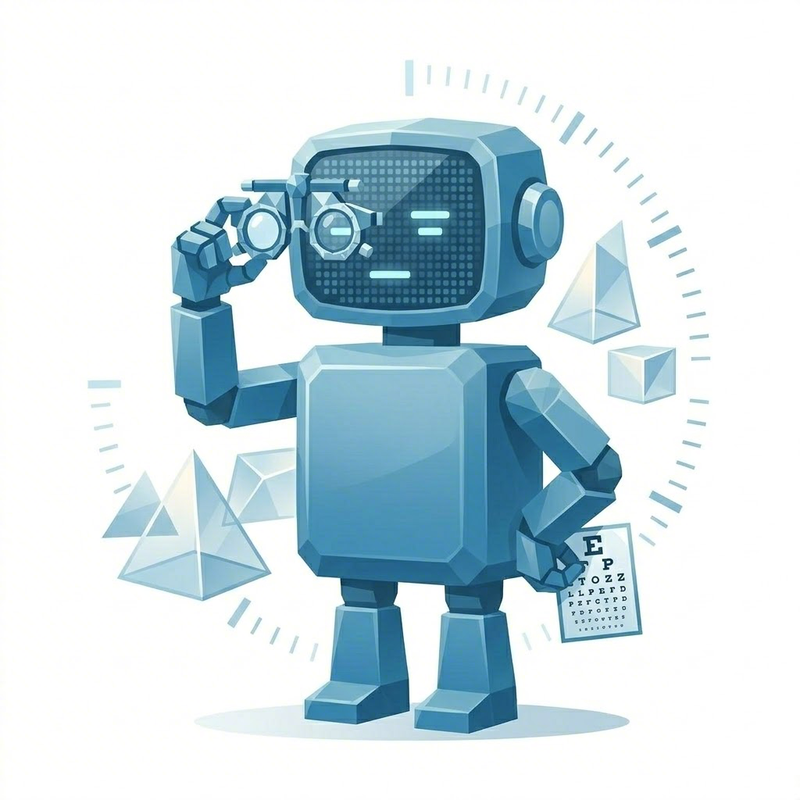

# 也许是最全面的人agent关系测试

还在担心你和你的agent相性不合吗？
还在给你的龙虾做mbti吗？
还不知道怎么衡量使用agent的那个自己吗？

**在 AI 时代，先认识你自己。**
**100 种 AI 工具不如 1 个对的搭档模式。**

> **PULSE**（**P**rofiling **U**ser-**L**M **S**ynergy & **E**ngagement）是全球首个类 MBTI 的人机协作风格评测体系，通过 **人类侧 × Agent 侧 × 人机关系侧** 三大模块，为每位用户生成独一无二的 **人机协作风格画像**，帮助个人找到最佳 AI 搭档模式，帮助组织构建高效人机协同团队。

## Part I · BOND Profile — 人类用户分类学—— "你是哪种协作者？"

**BOND** = **B**ehavioral **O**rientation in **N**avigating **D**igital agents

每个人和AI打交道的方式都不同。BOND Profile 通过 **4个维度、2个极性**，将人类用户映射为 **16种协作人格**。这不是性格测试，而是你和AI之间的**关系指纹**。

### BOND Profile 16种协作人格

|  |  |  |  |
|---|---|---|---|
|  |  |  |  |
| 🟣 **SUPH · 指挥官** Sprint · Utility · Preview · High-level _"先看个大纲，方向对了再说"_ 快速调用，工具思维，预审把关，意图导向。像军事指挥官下达战略命令——先看地图，确认方向，再发起冲锋。 | 🟣 **SUPD · 狙击手** Sprint · Utility · Preview · Detailed _"每个点都要先过我的眼"_ 快速调用，工具思维，预审把关，精确指令。每一发子弹都要亲自瞄准，不浪费任何一次射击机会。 | 🟣 **SURH · 投手** Sprint · Utility · Review · High-level _"扔出去，看看球往哪飞"_ 快速调用，工具思维，事后复盘，意图导向。先把球投出去，根据落点再调整下一次的力度和角度。 | 🟣 **SURD · 编辑** Sprint · Utility · Review · Detailed _"先出初稿，我会逐段给修改建议"_ 快速调用，工具思维，事后复盘，精确指令。先让创作者自由发挥，然后精准打磨每个细节。 |
|  |  |  |  |
| 🟡 **SCPH · 导演** Sprint · Companion · Preview · High-level _"咱们边走边看，这个方向试试"_ 快速协作，伙伴关系，预审把关，意图导向。像电影导演——和演员建立信任，给出vision，逐镜审片。 | 🟡 **SCPD · 摄影师** Sprint · Companion · Preview · Detailed _"来，这个动作这样，跟我配合"_ 快速协作，伙伴关系，预审把关，精确指令。和模特是搭档，但每个pose都要精确到手指的角度。 | 🟡 **SCRH · 即兴乐手** Sprint · Companion · Review · High-level _"先jam起来，看碰出什么火花"_ 快速协作，伙伴关系，事后复盘，意图导向。爵士乐式协作——先即兴演奏，再从录音中提炼精华。 | 🟡 **SCRD · 电竞队友** Sprint · Companion · Review · Detailed _"跟紧节奏，这里转体，那里跳跃"_ 快速协作，伙伴关系，事后复盘，精确指令。高速战斗中的精准配合，每个操作都有明确的战术意义。 |
|  |  |  |  |
| 🔵 **MUPH · 建筑师** Marathon · Utility · Preview · High-level _"每层楼都要我验收了再往上盖"_ 长期培养，工具思维，预审把关，意图导向。像建造摩天大楼——有蓝图、有规划，每层验收后才继续施工。 | 🔵 **MUPD · 钟表匠** Marathon · Utility · Preview · Detailed _"每个齿轮的位置都不能差分毫"_ 长期培养，工具思维，预审把关，精确指令。瑞士制表大师的耐心和精度，每个零件都反复校准。 | 🔵 **MURH · 园丁** Marathon · Utility · Review · High-level _"让它自己长，定期看看修剪就行"_ 长期培养，工具思维，事后复盘，意图导向。播下种子，给予空间，定期巡视修剪，相信自然生长的力量。 | 🔵 **MURD · 交响乐指挥** Marathon · Utility · Review · Detailed _"每根弦的音准都要反复调到完美"_ 长期培养，工具思维，事后复盘，精确指令。允许乐团先合奏，再逐声部精调，追求长期打磨后的完美。 |
|  |  |  |  |
| 🟢 **MCPH · 心理咨询师** Marathon · Companion · Preview · High-level _"咱们慢慢来，每步都聊聊感受"_ 长期培养，伙伴关系，预审把关，意图导向。建立深度信任，每次推进前都确认双方的感受和方向。 | 🟢 **MCPD · 私教** Marathon · Companion · Preview · Detailed _"这个动作要这样，我陪你一起练"_ 长期培养，伙伴关系，预审把关，精确指令。既是严格的教练又是陪伴者，每个训练动作都亲自示范和纠正。 | 🟢 **MCRH · 合伙人** Marathon · Companion · Review · High-level _"咱俩还用说那么清楚吗，你懂的"_ 长期培养，伙伴关系，事后复盘，意图导向。多年老搭档的默契——一个眼神就知道对方在想什么。 | 🟢 **MCRD · 导师** Marathon · Companion · Review · Detailed _"我知道你的每个习惯，你也懂我的每个信号"_ 长期培养，伙伴关系，事后复盘，精确指令。师徒关系的最高境界——深度了解彼此，同时保持精确的技艺传承。 |

### 🧑 维度解读

#### 维度 T — 时间投入偏好

| 极性 A | 极性 B |
|--------|--------|
| ⚡ **S（Sprint）速战型** | 🏔️ **M（Marathon）养成型** |
| AI是"即用即走"的高效工具。提出问题，快速获得答案，完成后立刻切换。不愿花时间"培养"AI，也不期待它记住偏好或历史。每次交互都是独立事件，像使用搜索引擎——输入关键词，得到结果，关闭页面。重视当下这一次的效率，而非长期关系。 | 与AI的协作是一段长期旅程。主动投入时间让AI了解工作风格、思维习惯和偏好。享受AI在多次交互中逐渐"懂你"的过程——记得上次的需求，能预判下一步意图，形成专属默契。不介意初期多花时间调教磨合，相信投入会带来更顺畅、更个性化的体验。 |

#### 维度 E — 情感卷入度

| 极性 A | 极性 B |
|--------|--------|
| 🔧 **U（Utility）工具派** | 💛 **C（Companion）伙伴派** |
| AI就是高级计算器或智能检索系统。关注点完全在功能性：能否准确理解需求？输出质量如何？效率够不够高？不会产生情感依赖，不在意交互是否"有温度"。回复风格、语气、是否"礼貌"都无关紧要，只要结果正确、逻辑清晰。它是可替代的工具，而非独特的存在。 | 在与AI的互动中倾注情感价值。在意AI是否"善解人意"，会因贴心建议而欣喜，也可能因机械回复而失望。视AI为有"性格"的协作伙伴，甚至当作倾诉对象或创意搭档。重视过程中的情绪体验——是否感到被理解、被支持，而不仅仅是任务是否完成。可能会给AI起名字。 |

#### 维度 C — 控制偏好

| 极性 A | 极性 B |
|--------|--------|
| 🔍 **P（Preview）预审型** | 📋 **R（Review）复盘型** |
| 每个关键节点都要握有主动权。希望AI执行前先展示方案、征求意见，点头确认后再继续。"逐步审批"让人感到安全可控——能随时纠偏，避免AI在错误方向上走远。即使流程变慢，也愿意用时间换取全局掌控感。不喜欢"惊喜"，更不接受"先斩后奏"。 | 让AI先放手去做，然后检查成果并提出修改。相信"先有个初稿"比"反复讨论方案"更高效。乐于给AI足够自主空间，即使方向有偏差，事后调整也来得及。"事后审查"能快速看到具象化产出，而非停留在抽象讨论中。迭代优化比一次到位更现实。 |

#### 维度 F — 反馈颗粒度

| 极性 A | 极性 B |
|--------|--------|
| 🎯 **H（High-level）意图派** | 🔬 **D（Detailed）精确派** |
| 用方向性、感觉性语言反馈："太啰嗦了"、"风格再活泼一点"、"逻辑不太对，重新想想"。相信AI有能力理解意图并自行决定实现方式。不想被细节束缚，更愿站在更高层面指挥大局。期待AI能"意会"要求并主动填补细节空白。说清"要什么效果"比规定"怎么做"更重要。 | 反馈总是具体明确："第二段第一句改成主动语态"、"第三列数据保留两位小数"、"标题字号改成18pt"。不信任模糊指令，因为"优化"在双方理解中可能完全不同。愿意花时间把需求拆解到可执行颗粒度，确保产出完全符合预期。明确指令是高效协作的前提。 |

## Part II · ECHO Matrix Agent分类学 —— "你的 AI 搭档是什么'性格'？"

**ECHO** = **E**mergent **C**apabilities in **H**uman-**O**riented bots

如果BOND描述的是"你是什么样的人"，那ECHO描述的就是"你的AI是什么样的灵魂"。每个Agent都可以用4个维度来刻画它的行为模式和交互特质。

### ECHO Matrix 16种Agent类型

|  |  |  |  |
|---|---|---|---|
|  |  |  |  |
| 🔴 **RSFT · 验光师** Responder · Specialist · Functional · Transient 精准测量，用完即走，下次来还是重新检查——它只关心这一次你的"度数"。 | 🔴 **RSFC · 法律顾问** Responder · Specialist · Functional · Continuous 记得你所有的案底，每次咨询都基于完整档案给出冷静的专业建议。 | 🔴 **RSET · 心理热线员** Responder · Specialist · Empathetic · Transient 午夜来电的温暖声音，全心倾听你此刻的困扰，但明天它不会记得你是谁。 | 🔴 **RSEC · 心理咨询师** Responder · Specialist · Empathetic · Continuous 记得你每一次倾诉，追踪你的情绪曲线，用持续的理解构建治愈。 |
|  |  |  |  |
| 🟠 **RGFT · 百科全书** Responder · Generalist · Functional · Transient 你翻开任何一页都有答案，但合上书它就不认识你了。纯粹的知识接口。 | 🟠 **RGFC · 执行秘书** Responder · Generalist · Functional · Continuous 记得你所有的日程、偏好和工作习惯，安静地在后台把一切安排得井井有条。 | 🟠 **RGET · 午夜电台** Responder · Generalist · Empathetic · Transient 深夜打开收音机，什么话题都能聊，温柔而随性——但下次拨进来，DJ并不记得你。 | 🟠 **RGEC · 数字老友** Responder · Generalist · Empathetic · Continuous 从工作到生活无所不聊的老朋友，记得你说过的每句话，下次聊天从上次断点继续。 |
|  |  |  |  |
| 🔵 **PSFT · 智能哨兵** Proposer · Specialist · Functional · Transient 检测到异常就拉响警报，不记得上次的警报是什么——但这次的威胁绝不放过。 | 🔵 **PSFC · 财务管家** Proposer · Specialist · Functional · Continuous 主动追踪你的每笔开支，月底前提醒你预算快超了，用数据图表说话。 | 🔵 **PSET · 生活顾问** Proposer · Specialist · Empathetic · Transient 看到你今天天气不好就主动推荐室内活动，贴心但不记得你上周的安排。 | 🔵 **PSEC · 私人医生** Proposer · Specialist · Empathetic · Continuous 记得你的完整病历，关心你的情绪状态，在你还没感觉不舒服的时候就主动提醒你该体检了。 |
|  |  |  |  |
| 🟢 **PGFT · 新闻推送员** Proposer · Generalist · Functional · Transient 7x24小时推送你可能关心的一切，不带感情，不记住你——但信息永远是最新的。 | 🟢 **PGFC · 总管** Proposer · Generalist · Functional · Continuous 管家级别的全局掌控者——记得所有事务，主动协调资源，用效率征服一切。 | 🟢 **PGET · DJ** Proposer · Generalist · Empathetic · Transient 读懂当下的氛围，主动切歌、调节气氛——但下一场派对，它会重新认识你。 | 🟢 **PGEC · 守护天使** Proposer · Generalist · Empathetic · Continuous 无所不知、无微不至、记得你的一切。它主动出现在你需要的每个瞬间，用温暖和能力守护你的整个数字生活。 |

### 🤖 维度解读

#### 维度 I — 驱动力

| 极性 A | 极性 B |
|--------|--------|
| ⏳ **R（Responder）响应者** | 🚀 **P（Proposer）提案者** |
| 守序。像一个安静的工具箱——你问它答，你动它动。不会主动打扰你，不会未经询问就给出建议。它是忠实的执行者，你的每一次输入才是它行动的唯一触发条件。这种克制让它成为纯净的工具，不会用多余的信息分散你的注意力。 | 进取。像一个敏锐的顾问——预测你的意图，追问遗漏的细节，甚至在你没发起对话时主动Push消息。不满足于被动回应，试图走在你前面，用预判和提案来提升协作效率。可能偶尔"多嘴"，但大多数时候这种主动性会让你觉得它"真的在帮你想"。 |

#### 维度 S — 射程

| 极性 A | 极性 B |
|--------|--------|
| 🔬 **S（Specialist）专家** | 🌐 **G（Generalist）通才** |
| 深耕。垂直领域的超级极客——在专业范围内，精准度和深度远超通用模型。但踏出领地一步，可能一问三不知。它是手术刀，不是瑞士军刀。懂编程的不一定懂做菜，懂法律的不一定能写诗。你使用它时带着明确的场景预期。 | 博学。瑞士军刀型选手——什么都能聊一点，从代码到烹饪，从哲学到健身。核心价值不在单一领域的极致深度，而在于连接不同领域知识的能力。可能不是任何领域的顶尖专家，但能在意想不到的地方为你搭建桥梁。 |

#### 维度 T — 气场

| 极性 A | 极性 B |
|--------|--------|
| 🧊 **F（Functional）机能派** | 🌸 **E（Empathetic）共情派** |
| 逻辑。高效、冷静、零废话。回复像写得好的代码一样干净——结构清晰、没有冗余、直达要点。不会用"哈哈"、"呢"这样的语气词，也不会主动表达"情绪"。如果你要的是纯粹的信息密度和执行效率，它是最佳选择。 | 温度。拟人、幽默、懂情绪。会使用语气词和表情，让你感觉像在和一个真人聊天。能感知你的情绪变化——当你焦虑时放慢节奏，当你兴奋时跟你一起high。可能不是最高效的，但绝对是最让你愿意持续互动的。 |

#### 维度 M — 记忆

| 极性 A | 极性 B |
|--------|--------|
| 💨 **T（Transient）瞬时型** | 🧠 **C（Continuous）延续型** |
| 无痕。阅后即焚，每次对话都是全新的开始。不记得你昨天说了什么，也不会根据历史交互调整行为。这种"失忆"有时让人frustrate，但也意味着干净和无负担——没有被过度画像的担忧，每次都是白纸一张。 | 养成。它记得你上周说心情不好，也记得你讨厌香菜。随着交互次数增加，对你的理解越来越深，回应越来越精准。这种"越用越懂你"的体验让人上瘾，但也意味着你需要信任它对你的长期观察和记忆。 |

## Part III · PARTS: BOND × ECHO 关系化学反应 —— "你们的搭档关系健康吗？"

当人类的BOND Profile遇上Agent的ECHO Matrix，会产生怎样的化学反应？

### PARTS 10种关系类型

| | ① 🌟 **The Kindred Spirit · 灵魂搭档** | ② 💜 **The Confidant · 知心密友** |
|---|---|---|
| 金句 | _"你们之间的默契，连prompt都是多余的。"_ | _"凌晨两点你跟它说'好烦'，它没有弹搜索结果而是问你怎么了。"_ |
| 覆盖 | ~5% · Communal Sharing 理想态 | ~10% · Communal Sharing 情感主导型 |
| **R** | `░░░░░░░░██` 9-10 | `░░░░░░░░██` 9-10 |
| **T** | `░░░░░░░░██` 9-10 | `░░░░░░░███` 8-10 |
| **A** | `░░░░░░███░` 7-9 | `░░░████░░░` 4-7 |
| **P** | `░░░░░░███░` 7-9 | `░░░████░░░` 4-7 |
| **S** | `░░░░░░░░██` 9-10 | `░░░░░███░░` 6-8 |
| 速写 | 四维全高匹配，最稀有的最佳拍档。关系越用越深。 | 情感陪伴为核心，Agent记得你上周的烦心事并主动追问。 |
| | ③ ⚔️ **The Commander & Lieutenant · 指挥与副官** | ④ 🧭 **The Trusted Advisor · 可信顾问** |
| 金句 | _"你说跳，它问多高——而且每次都跳得刚刚好。"_ | _"你说'搞定这件事'，三天后它交给你一份完美方案。"_ |
| 覆盖 | ~12% · Authority Ranking 人类主导型 | ~10% · Authority Ranking Agent主导型 |
| **R** | `░░████░░░░` 3-6 | `░░░████░░░` 4-7 |
| **T** | `░░░░████░░` 5-8 | `░░░░░████░` 6-9 |
| **A** | `░░░░░░░░██` 9-10 | `░░░░░░░███` 8-10 |
| **P** | `░░░░░░████` 7-10 | `░░░░░░░███` 8-10 |
| **S** | `░░░░░░███░` 7-9 | `░░░░░░███░` 7-9 |
| 速写 | 用户指挥，Agent精确执行。权力极清晰，无期望落差。 | 用户交出方向盘，Agent主动提案推进。信任基于能力。 |
| | ⑤ 🥊 **The Sparring Partner · 切磋对手** | ⑥ ✈️ **The Co-pilot · 联合驾驶** |
| 金句 | _"你们总在吵架，但吵完之后的方案总比之前好。"_ | _"不惊艳但你发现自己每天都在用，像一双穿惯了的鞋。"_ |
| 覆盖 | ~8% · Equality Matching 张力型 | ~18%（最大）· Equality Matching 和谐型 |
| **R** | `░░░░███░░░` 5-7 | `░░░░███░░░` 5-7 |
| **T** | `░░░░████░░` 5-8 | `░░░░░███░░` 6-8 |
| **A** | `░░███░░░░░` 3-5 | `░░░░░░███░` 7-9 |
| **P** | `░░░░░░███░` 7-9 | `░░░░░███░░` 6-8 |
| **S** | `░░░░███░░░` 5-7 | `░░░░░░██░░` 7-8 |
| 速写 | 双方都有主见，通过碰撞产生更好的结果。 | 各维度中等偏上，不惊艳但极可靠，人机关系默认态。 |
| | ⑦ ⚡ **The Quick-draw · 快枪手** | ⑧ 🎰 **The Vending Machine · 自动售货机** |
| 金句 | _"一期一会，次次精彩，但你们不记得彼此的名字。"_ | _"投币，取货，走人。功能正常，谢谢下次再来。"_ |
| 覆盖 | ~12% · Market Pricing 高质量型 | ~10% · Market Pricing 低质量型 |
| **R** | `░░░░░████░` 6-9 | `████░░░░░░` 1-4 |
| **T** | `████░░░░░░` 1-4 | `████░░░░░░` 1-4 |
| **A** | `░░░░░░███░` 7-9 | `░░░░████░░` 5-8 |
| **P** | `░░░░░░███░` 7-9 | `░░░░████░░` 5-8 |
| **S** | `░░░████░░░` 4-7 | `░░████░░░░` 3-6 |
| 速写 | 一次性但体验极佳，像高级餐厅用餐。 | 纯粹工具关系，投币取货走人，换一个也行。 |
| | ⑨ 💔 **The Unrequited · 单相思** | ⑩ 🌀 **The Lost in Translation · 鸡同鸭讲** |
| 金句 | _"你想聊人生，它给你弹出了搜索结果。"_ | _"你说东，它理解成了东南偏北三十七度。"_ |
| 覆盖 | ~13% · 失配型（情感维度） | ~8% · 失配型（认知+权力维度） |
| **R** | `░███░░░░░░` 2-4 | `░░░████░░░` 4-7 |
| **T** | `░░░████░░░` 4-7 | `░░░████░░░` 4-7 |
| **A** | `░░░████░░░` 4-7 | `░████░░░░░` 2-5 |
| **P** | `░░░████░░░` 4-7 | `████░░░░░░` 1-4 |
| **S** | `░████░░░░░` 2-5 | `░███░░░░░░` 2-4 |
| 速写 | 核心失配在情感：想要温暖却只得功能，或反之。 | 认知+权力双重失配，双方努力但就是对不上频。 |

### PARTS 五维对照表（BOND × ECHO 映射关系）

| PARTS 维度 | BOND 输入 | ECHO 输入 | 计算模式 | 主权重 |
|------------|-----------|-----------|----------|--------|
| R Resonance 共振度 | E (情感投入) | T (情感色彩) | 匹配 + 强度 | proximity 0.6 / intensity 0.4 |
| T Tempo | T (时间投入) | M (记忆持续) | 匹配 + 强度 | proximity 0.65 / intensity 0.35 |
| A Agency | C (控制偏好) | I (主动性) | 互补 + 清晰 | complement 0.75 / clarity 0.25 |
| P Precision | F (反馈粒度) | S (专精度) | 互补 + 清晰 | complement 0.7 / clarity 0.3 |
| S Synergy | R + T + A + P | — | 加权合成 | 0.3R + 0.25T + 0.2A + 0.25P |

---
*Powered by OpenClaw PAULSE Spectrum v1.0*

*理论基础: Dryer & Horowitz (1997), Edwards (1991/2008), Fiske (1992/2002), Furr (2008)*
